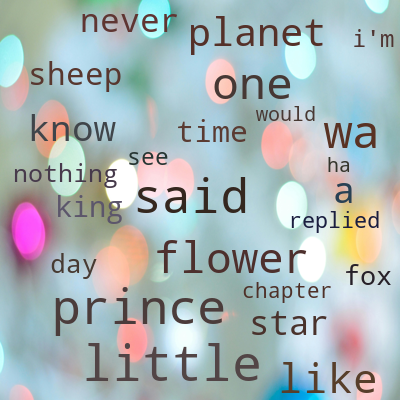

# smart_word_cloud
```json
{
    "Description": "A smart word cloud generator.",
    "Author": "Yewei Liu (Lewis)",
    "Email": "liuyeweilewis@gmail.com or 2300012959@stu.pku.edu.cn",
}
```



# features
- **Smart Text Processing**: Using nlp tricks to better process words.
- **Flexible Designs**: Can flexibly change the size, many intermidiate functions etc.
- **Fast**: Using 2D Prefix Sum to speed up the detection of empty space.
- **Attractive**: Adding breath-taking background and set arbitrary shape and color   for your word cloud.
- **Easy to use**: With only a few lines of codes, you can generate your own word cloud.

# download
`pip install smartwordcloudgenerator`

# Example
To generate the example image of book the little prince, we need codes:
```python
import numpy as np
from smartwordcloudgenerator import SmartWordCloudGenerator as scg

input_path = 'input/the little prince.txt'
lines = None
with open(input_path, encoding='utf-8') as f:
    lines = f.readlines()
text = "".join(lines)

gen = scg()
gen.add_text(text)
gen.generate(color_mode='contrast', background_path='background.jpg')
```
you can choose the input and the background by yourself

# More
More detailed tutorial is coming soon.
If you have any advice or thoughts, feel free to contact me :)